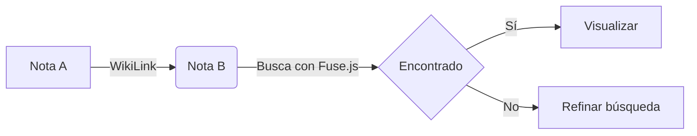

# Guía de Recursos del Sistema de Notas

Esta es tu guía rápida para aprovechar al máximo tu nuevo sistema de notas estilo **Obsidian**. Aquí aprenderás a usar los hipervínculos, diagramas y formatos disponibles.

## 🔗 WikiLinks (Hipervínculos)

Puedes conectar tus notas usando la sintaxis de corchetes dobles. El sistema convertirá automáticamente el nombre al formato de archivo correspondiente.

- **Enlace simple**: [[Bienvenida]] (Apunta a `bienvenida.md`)
- **Enlace con alias**: [[Bienvenida|Ir a la nota de inicio]]
- **Nota inexistente**: Si intentas enlazar a una nota que no existe, el enlace se creará pero no mostrará contenido al hacer clic.

---

## 📊 Diagramas con Mermaid

Puedes crear diagramas complejos usando bloques de código con la etiqueta `mermaid`.



Soportamos diagramas de flujo, de secuencia, mapas mentales y más.

---

## 💻 Resaltado de Sintaxis

El sistema detecta automáticamente el lenguaje de programación para aplicar colores:

```typescript
function saludar(nombre: string) {
  console.log(`Hola, ${nombre}! Bienvenido a tus notas.`);
}
```

---

## 📝 Markdown Estándar

Tienes soporte completo para:
- **Tablas**
- **Listas de tareas**: 
    - [x] Configurar buscador
    - [x] Implementar WikiLinks
    - [ ] Escribir mi primera nota real
- **Citas**: 
    > "La mejor forma de predecir el futuro es creándolo."

---

## 🔍 Búsqueda e Interfaz

- **Buscador**: En la parte superior del sidebar, puedes buscar por título o por cualquier palabra que esté dentro del contenido de las notas.
- **Responsive**: Si estás en móvil, usa el botón flotante morado para abrir y cerrar tu lista de notas.
- **Navegación**: El botón de la casita ([[FiHome]]) en el sidebar te devuelve a tu portafolio principal.
