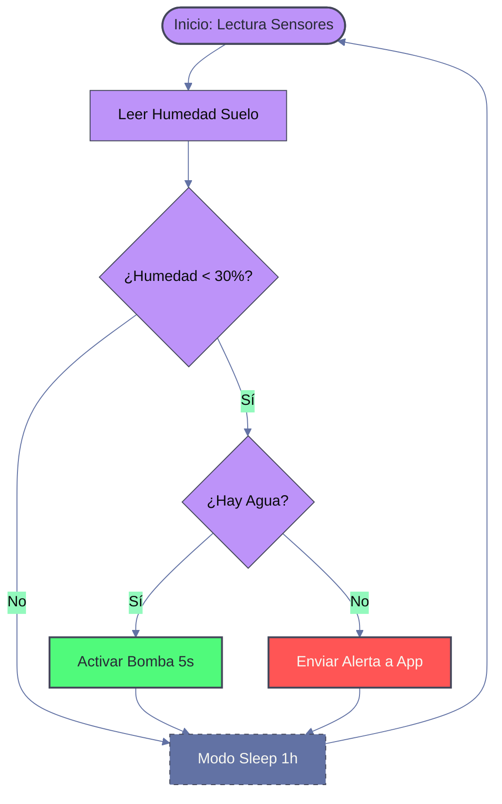

```mermaid
%%{init: {
  'theme': 'base',
  'themeVariables': {
    'primaryColor': '#bd93f9',
    'primaryTextColor': '#0A0B0C',
    'primaryBorderColor': '#44475a',
    'lineColor': '#6272a4'
  }
}}%%
flowchart TD
    %% 1. DECLARACIÓN DE NODOS (Evita el error de STYLE_SEPARATOR)
    Start([Inicio: Lectura Sensores]):::start
    Read[Leer Humedad Suelo]
    Threshold{¿Humedad < 30%?}
    CheckWater{¿Hay Agua?}
    Sleep[Modo Sleep 1h]:::sleep
    PumpOn[Activar Bomba 5s]:::action
    Alert[Enviar Alerta a App]:::alert

    %% 2. CONEXIONES (Limpio de clases)
    Start --> Read
    Read --> Threshold
    
    Threshold -- Sí --> CheckWater
    Threshold -- No --> Sleep
    
    CheckWater -- Sí --> PumpOn
    CheckWater -- No --> Alert
    
    PumpOn --> Sleep
    Alert --> Sleep
    Sleep --> Start

    %% 3. ESTILOS (Dracula Pro)
    classDef start fill:#bd93f9,color:#282a36,stroke-width:2px
    classDef action fill:#50fa7b,color:#282a36,stroke-width:2px
    classDef alert fill:#ff5555,color:#f8f8f2,stroke-width:2px
    classDef sleep fill:#6272a4,color:#f8f8f2,stroke-dasharray: 5 5
```

