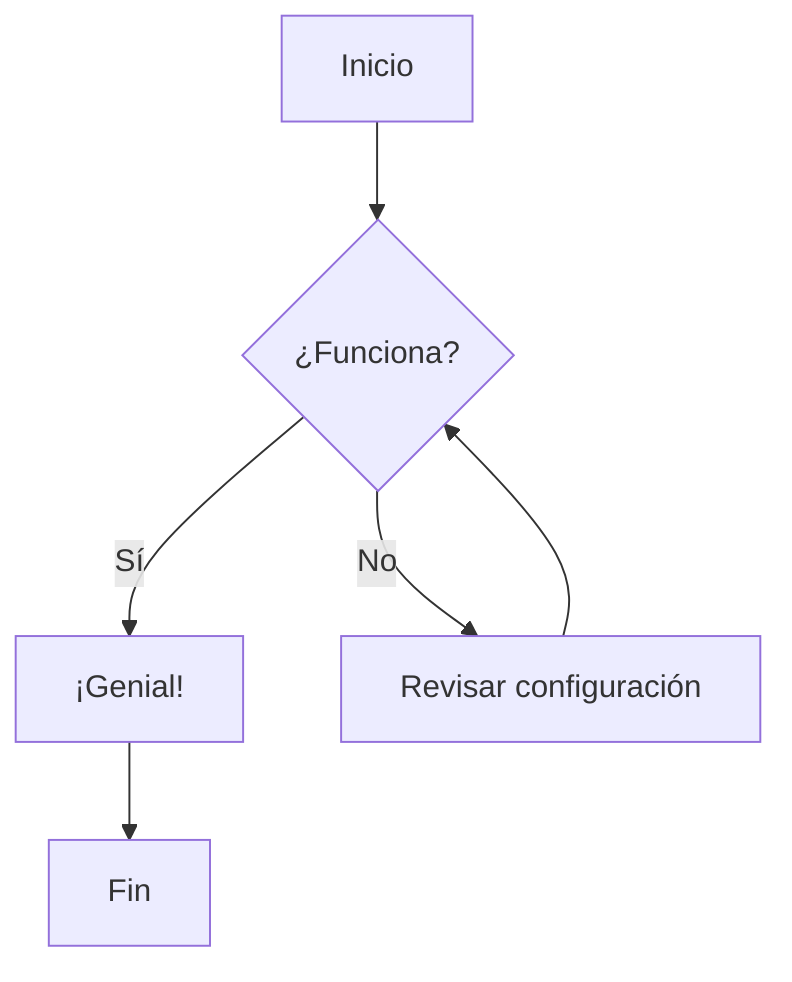

# Bienvenidos a mis notas

> [!TIP] Notas personales
> En su mayoria solo seran comandos en terminal que necesito tener siempre a la mano.

## Diagrama de Flujo

## Lista de tareas
- [ ] Crear ruta /notes
- [ ] Implementar sidebar
- [ ] Configurar Fuse.js
