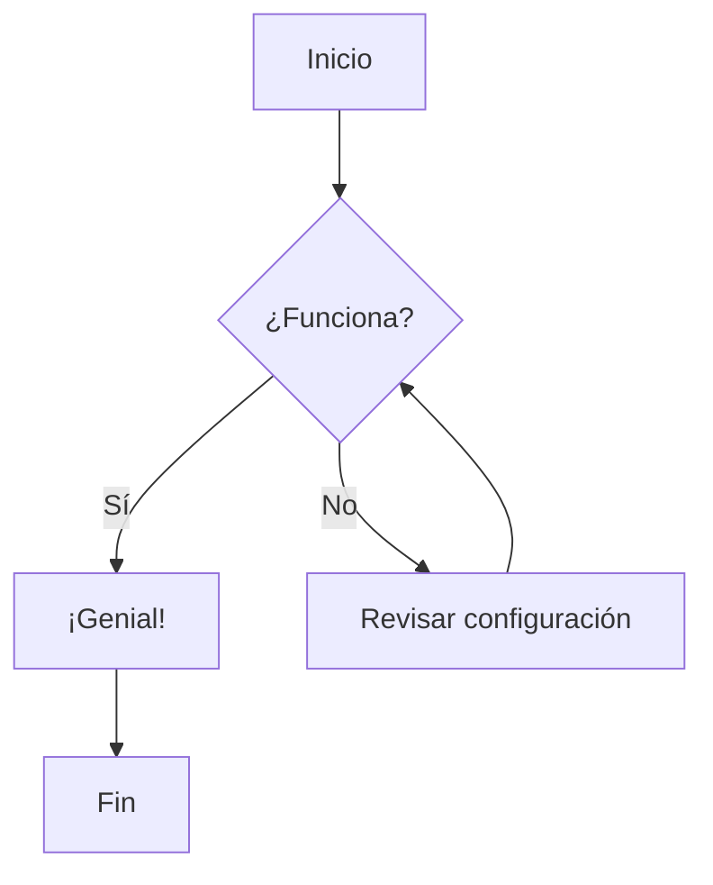

# Bienvenidos a mis notas

Este es un ejemplo de una nota en Markdown que incluye un diagrama de **Mermaid**.

## Diagrama de Flujo

## Lista de tareas
- [ ] Crear ruta /notes
- [ ] Implementar sidebar
- [ ] Configurar Fuse.js
